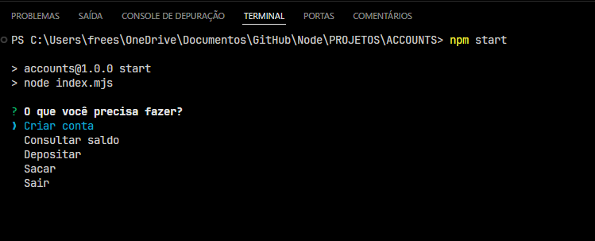

#### Interface

- **Objetivo:** Simular operações bancárias (criação de contas, consulta de saldo, depósito e saque) via terminal.

### Estrutura do Código:

#### 1. **Importações:**

- `inquirer`: Utilizado para interagir com o usuário via terminal.
- `chalk`: Fornece cores e estilos ao texto exibido no terminal.
- `fs`: Manipulação de arquivos para armazenar os dados das contas.

#### 2. **Funções Principais:**

- `operation`: Menu principal onde o usuário escolhe uma operação bancária (Criar conta, Consultar saldo, Depositar, Sacar, Sair).
- `createAccount`: Cria uma nova conta e armazena o saldo inicial (0) em um arquivo `.json`.
- `verifyBalance`: Consulta e exibe o saldo da conta a partir do arquivo JSON.
- `deposit`: Adiciona um valor ao saldo da conta escolhida.
- `withdraw`: Realiza o saque de um valor, subtraindo do saldo atual, desde que o saldo seja suficiente.
- `exit`: Encerra o programa.

#### 3. **Processo de Manipulação de Dados:**

- As contas são salvas em arquivos JSON dentro da pasta `accounts-bank`.
- Cada operação lê e escreve nesses arquivos para atualizar o saldo.

#### 4. **Fluxo:**

- Após cada operação, o programa retorna ao menu principal (`operation`), criando um loop de interação com o usuário até a escolha de "Sair".

Este projeto simula operações bancárias básicas e serve como prática para trabalhar com entradas no terminal e manipulação de arquivos.
